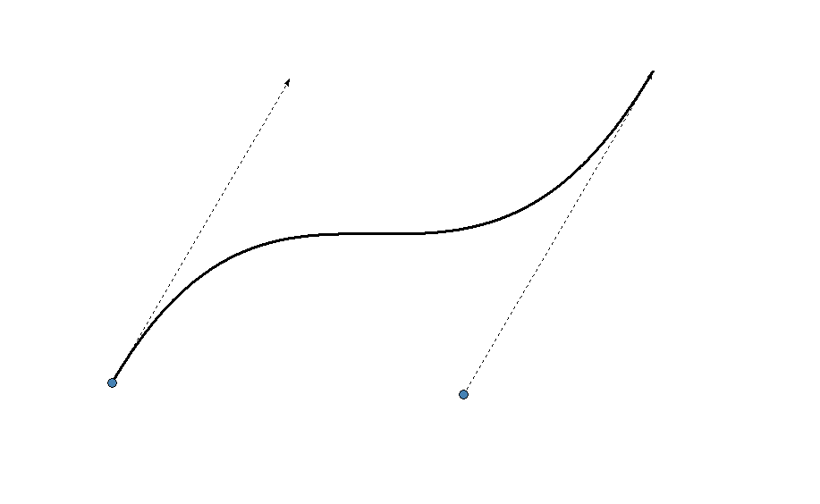

# Графический редактор
Цель курса: изучения алгоритмов построения различных геометрических
фигур, и наглядное отображение работы этих алгоритмов в графическом интерфейсе 

Главный интерфейс:

## Построение отрезков
Меню для отрезков:

При нажатии любого из пунктов открывается окно для ввода входных параметров:

После ввода всех параметров и нажатия кнопки "Построить отрезок" открывается окно, на котором отображен результат в
зависимости от выбранного алгоритма. При этом, если был выбран "Режим отладки", то для отображения результата
нужно нажимать клавишу "Пробел", после чего каждый пиксель будет выводиться отдельно, если же режим отладки не был
выбран то фигура отразится сразу.

Алгоритм ЦДА:

Алгоритм Брезенхема:

Алгоритм Ву:

Вывод: в данной лабораторной были изучены 3 алгоритм построения отрезка, реализовано их 
поэтапное и цельное отображение.

## Построение фигур второго порядка
Меню для фигур второго порядка:

При нажатии одного из пунктов меню откроется соответствующее фигуре окно для ввода входных параметров.
Режим отладки тут работает также, как и при построении отрезков. Для построения каждой фигуры используется алгоритм
Брезенхема, который использует соответствующую формулу фигуры.

### Окружность
Окно ввода данных:

Результат:

### Эллипс

Окно ввода данных:

Результат:

### Гипербола

Окно ввода данных:

Результат:

### Парабола

Окно ввода данных:

Результат:

Вывод: в результате лабораторной работы были изучены и реализованы алгоритмы построения кривых второго порядка,
а также реализовано их поэтапное и цельное отображение.

## Построение кривых
Меню для кривых:

При нажатии одного из пунктов меню откроется соответствующее фигуре окно c холстом для задания опорных точек.
Задание опорных точек отличается для каждого из алгоритмов.

### Алгоритм Эрмита
При нажатий ЛКМ по холсту откроется окно для ввода дополнительных параметров:

Для построения кривой требуется как минимум 2 заданные точки. По умолчанию кривые будут создаваться только по 2 точкам,
но при нажатии на чек-бокс "Режим состыковки" кривая будет продолжаться от заданных ранее точек.

Результат:

Для изменения опорной точки нужно нажать пот ней ПКМ и проделать ту же операцию, что и с ее добавлением.

### Алгоритм Безье

При выборе данного пункта откроется окно, почти идентичное предыдущему, за исключением чек-бокса(тут он отсутствует).

При нажатии на холст создается точка и стрелка, следующая за курсором. Чтобы задать точку нужно нажать на холст повторно, 
чтобы нарисовать кривую нужно задать две опорные точки:

В данном алгоритме для состыковки кривых нужно задавать новую стартовую точку начиная из предыдущей, причем
направление новой касательной должно совпадать с направлением предыдущей:

Для изменения опорной точки нужно нажать на нее ПКМ.

### ВСплайн

В окне для ввода данных появилась кнопка "Построить кривую" при нажатии на нее будет строиться(вау) замкнутый сплайн
по заданным опорным точкам. Порядок заданных точек имеет значение.

Входные данные:

Результат:

Вывод: в результате лабораторной работы были изучены и реализованы алгоритмы построения кривых,
а также реализовано их отображение.

## Геометрические преобразования

В данной лабораторной работе на вход идет файл с координатами точек. После выбора такого файл, в зависимости от координат точек отображается фигура:

К данной фигуре можно применять различные геометрические преображения по средством нажатия клавиш:

В результате нажатия клавиш можно получить следующую фигуру:

Вывод: в результате лабораторной работы были изучены и реализованы алгоритмы геометрических преображений 3д фигур,
а также реализовано их отображение.

## Построение полигонов

В данной лабораторной работе интерфейс выгляди следующим образом:

Результатом работы с лабораторной работой может быть:

Вывод: в результате лабораторной работы были изучены и реализованы алгоритмы построения полигонов,
а также реализовано их отображение.
